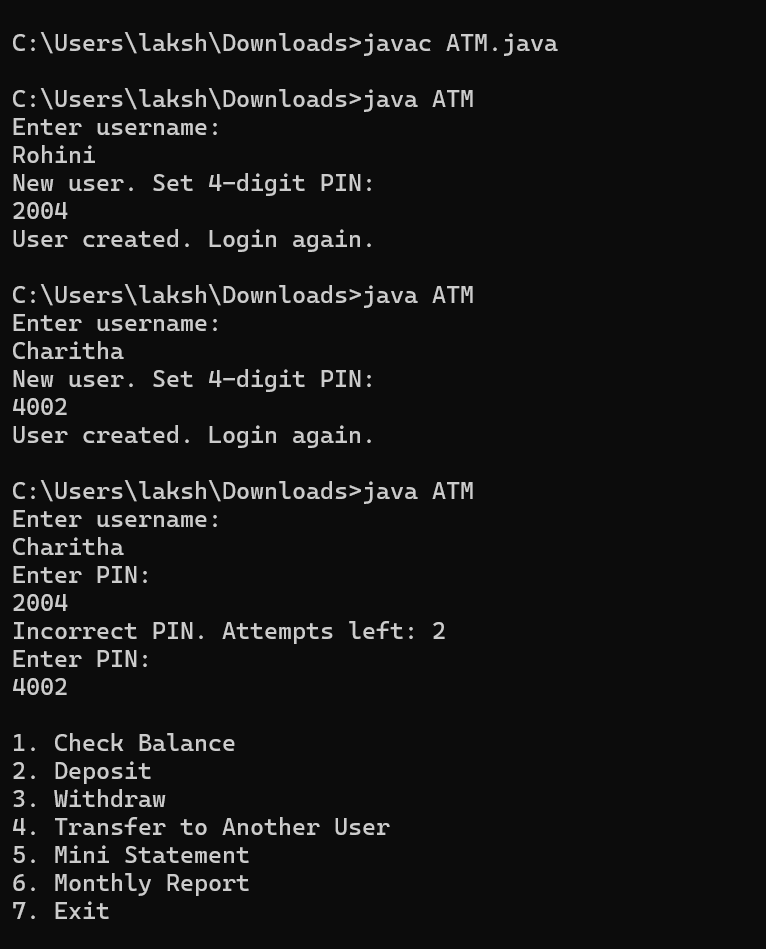
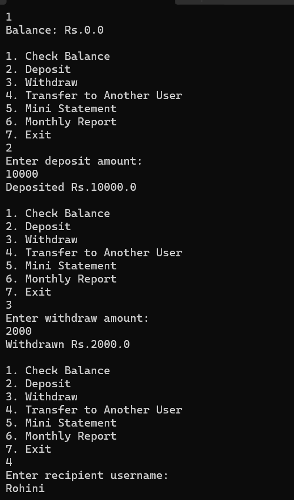
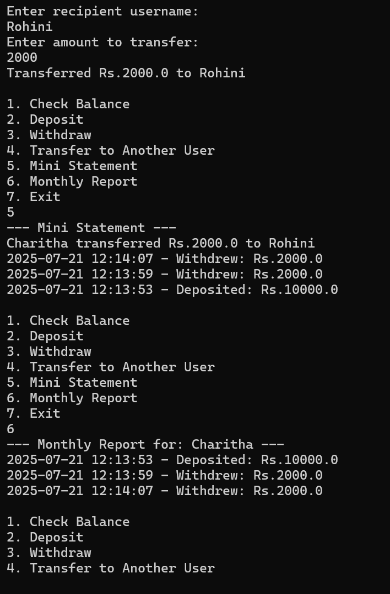
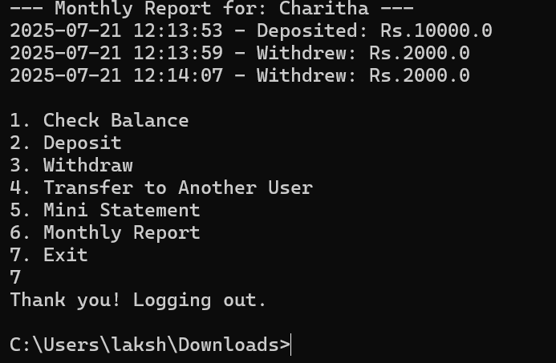

# 💳 ATM Interface in Java (with Admin & Multi-User Support)

This is a fully functional **ATM Interface** written in **Java** using **object serialization** and **file handling**. It supports multiple users, secure PIN verification, transaction history, admin functionalities, and basic banking features like deposit, withdraw, and transfer.

---

## 🔧 Features

### 👤 User Features:
- Secure **PIN verification** (3 attempts)
- **Deposit** and **Withdraw** money
- **Check balance**
- **Transfer** funds to another user
- **Mini Statement** (last 10 transactions)
- **Monthly Report** (stored in a `.txt` file)
- Transaction history persisted in `username_statement.txt`

### 🔐 Admin Panel:
Login as `admin` (PIN: `0000`) to:
- View all users and their balances
- View any user’s transaction history
- **Delete a user**
- **Reset a user's PIN** (if allowed)
  
---

## 📁 File Structure

ATM.java --> Main file containing both user and admin functionality
users.dat --> Serialized user data (auto-generated)
<username>_statement.txt --> Each user's transaction history file

## 🛠 How to Run

### ✅ Requirements:
- Java 8 or higher
- Any IDE (VS Code, IntelliJ, Eclipse) or Terminal

### ▶️ Run:
In VScode -> Copy paste code -> Terminal -> javac ATM.java -> java ATM ->Enter
In Command Prompt -> Copy paste in Notepad -> Save as ATM.java -> Go to cmd -> javac ATM.java ->java ATM

## 🖼 Output Screenshots

### 🏦 ATM Main Menu

### 🔐 User Login

### 💰 Deposit and Mini Statement

### 🔧 Admin Panel

